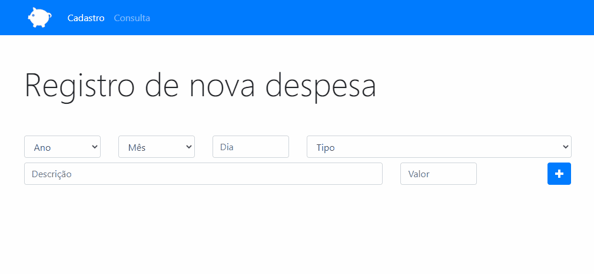

<h1>Personal Budget Project</h1>

With the PERSONAL BUDGET application it is possible to register your expenses and store them in localStorage, also being able to browse and use filters on your registered expenses; the application has two pages, one for registration and another for consultation.

<h2>the following technologies were used for the development of the application:</h2>

HTML5

Bootstrap

Javascript
