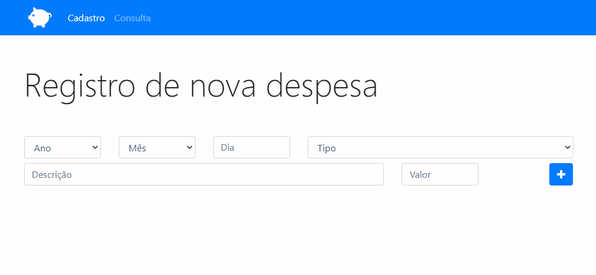

<h1>Projeto orçamento pessoal</h1>

Com a aplicação ORÇAMENTO PESSOAL é possível cadastrar suas despesas e armazenar em localStorage, podendo também navegar e utilizar filtros nas suas despesas cadastradas; a aplicação conta com duas páginas, uma de cadastro e outra de consulta.

<h2>as seguintes tecnologias foram utilizadas para o desenvolvimento da aplicação:</h2>

HTML5

Bootstrap

Javascript
